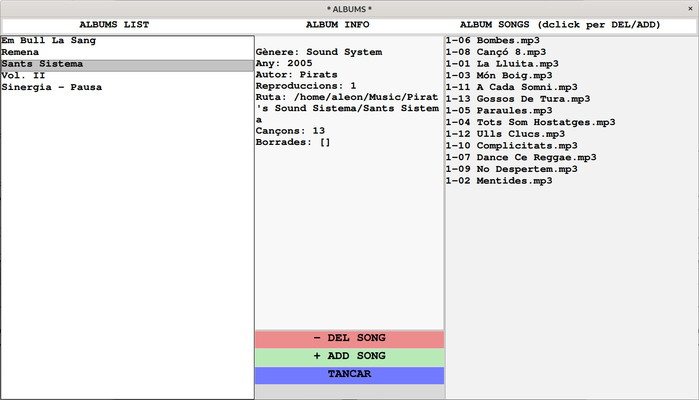

# MPCPy

Exemple d'un reproductor MP3 GUI (amb interfície gràfica d'usuari) amb Python i tkinter, per MPD i MPC de GNU Linux.
Amb finestra principal, subfinestres, refresc pantalla, control de volum, equalitzador animat, botonera, control ListboxSelect, Double Click, ...
Ús de  classes, gestió de llistes de reproducció i fitxers.

## Requeriments

- OS: Arch Linux x86_64
- Kernel: 6.0.9-arch1-1
- DE: GNOME 43.1
- python >= 3.8
- MPD: Music Player Daemon 0.23.5 (0.23.5)
- MPC: A minimalist command line interface to MPD / mpc version: 0.34
- tkinter 8.6.12

## MPD
https://www.musicpd.org/
https://mpd.readthedocs.io/en/stable/user.html

- sudo pacman -S mpd (**arch**)
- apt install mpd (**ubuntu**)
- configure /etc/mpd.conf
- add permissions rx for others (user mpd) in all of necessary folders
- add permissions rx for others in /home/user if is necessary
```
music_directory "/home/aleon/Música"
playlist_directory "/home/aleon/playlists"
user "mpd"
auto_update "yes"
audio_output {
        type            "alsa"
        name            "My ALSA Device"
#       device          "hw:0,0"        # optional
#       mixer_type      "hardware"      # optional
#       mixer_device    "default"       # optional
##      mixer_control   "PCM"           # optional
##      mixer_index     "0"             # optional
}
#
...
```
- load mp3 music in music_directory
- add info.txt in every album directory with gender, year and author 
- sudo systemctl enable mpd
- sudo systemctl start mpd
- sudo systemctl status mpd
- check errors, files, directories and folder permissions
- reboot if is necessary

## MPC
https://www.musicpd.org/clients/mpc/
https://www.musicpd.org/doc/mpc/html/

- sudo pacman -S mpc (**arch**)
- apt install mpc (**ubuntu**)
- mpc update
- mpc ls
- mpd add /
- mpc play

## tkinter
https://docs.python.org/3/library/tkinter.html
https://realpython.com/python-gui-tkinter/

(**arch**)
- sudo pacman -S tk
- sudo pacman -S pyqt5
- sudo pacman -S pyside2
- sudo pacman -S python-pillow

## mpcpy_aleon

- DIR_MUSIC = '/home/aleon/Music' (= /etc/mpd.conf)
- DIR_PLAYLIST = '/home/aleon/playlists' (/etc/mpd.conf)

## files

- **albums**: album objects pickel
- **estat_reproductor**: MPC current state
- **playlist.txt**: current playlist
- **playlists.txt**: list of playlist
- **info.txt**: album information in album folder
```
gender
year
author
```

## Run

- python3 tk_aleon.py


